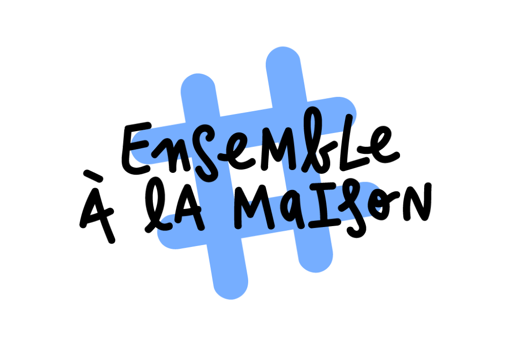

# Programmation_Web
Projet de programmation Web - séances de projets

 

### Description:
Containment is a difficult period. We find the time long, we don't know what to do ... This site is made for you! You will find there various articles, concerning various subjects such as the purchases, the work, the sports activities or still a global view on the world.

On the home page, you will find some funny pictures or music, allowing you to change your mind. These are coded in javascript.

The Articles tab allows you to display all the categories of articles already present on the site. You can add articles, thanks to the Add an article tab.

### How to access the site?
The web page is on a local server: http://localhost:8000/

You must type the following commands:

./do

./do serve

### Authors:

For bug reports and feedback do not hesitate to contact the authors

+ Anne Ravix: anne.ravix @ insa-lyon.fr
+ Mélanie Sawaryn: melanie.sawaryn @ insa-lyon.fr
+ Tanguy Pace: tanguy.pace @ insa-lyon.fr
+ Jonathan Louison: jonathan.louison @ insa-lyon.fr

### Maintainer:

+ Anne Ravix: anne.ravix @ insa-lyon.fr
+ Mélanie Sawaryn: melanie.sawaryn @ insa-lyon.fr
+ Tanguy Pace: tanguy.pace @ insa-lyon.fr
+ Jonathan Louison: jonathan.louison @ insa-lyon.fr
